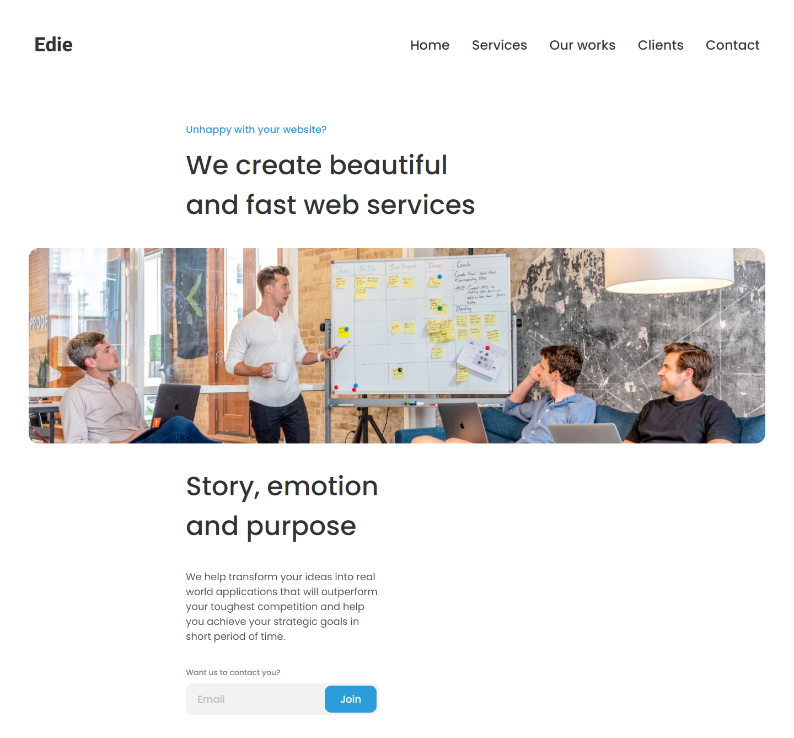

<!-- Please update value in the {}  -->

<h1 align="center">Edie Homepage</h1>

<div align="center">
   Solution for a challenge from  <a href="http://devchallenges.io" target="_blank">Devchallenges.io</a>.
</div>

<div align="center">
  <h3>
    <a href="https://devchallenges-edie-homepage-master.vercel.app/">
      Demo
    </a>
    <span> | </span>
    <a href="https://github.com/antoineterny/devchallenges-edie-homepage-master">
      Solution
    </a>
    <span> | </span>
    <a href="https://devchallenges.io/challenges/xobQBuf8zWWmiYMIAZe0">
      Challenge
    </a>
  </h3>
</div>

<!-- TABLE OF CONTENTS -->

## Table of Contents

- [Overview](#overview)
- [Features](#features)
- [How to use](#how-to-use)
- [Contact](#contact)
- [Acknowledgements](#acknowledgements)

<!-- OVERVIEW -->

## Overview

[](https://devchallenges-edie-homepage-master.vercel.app/)

This one was a pain ! I must admit I didn't think enough about the responsive aspects of the page in advance, so I had a hard time managing it afterwards. I tried to make a simple sticky mobile menu in css, which isn't perfect.  
In the end, even if I didn't learn any new technology with this project, I gained a lot of experience by doing mistakes I won't repeat in the future !

## Features

<!-- List the features of your application or follow the template. Don't share the figma file here :) -->

This application/site was created as a submission to a [DevChallenges](https://devchallenges.io/challenges) challenge. The [challenge](https://devchallenges.io/challenges/xobQBuf8zWWmiYMIAZe0) was to build an application to complete the given user stories.

## How To Use

<!-- Example: -->

To clone and run this application, you'll need [Git](https://git-scm.com) and [Node.js](https://nodejs.org/en/download/) (which comes with [npm](http://npmjs.com)) installed on your computer. From your command line:

```bash
# Clone this repository
$ git clone https://github.com/antoineterny/devchallenges-edie-homepage-master

# Install dependencies
$ npm install

# Run the app
$ npm start
```

## Acknowledgements

<!-- This section should list any articles or add-ons/plugins that helps you to complete the project. This is optional but it will help you in the future. For example -->

- [Steps to replicate a design with only HTML and CSS](https://devchallenges-blogs.web.app/how-to-replicate-design/)
Which I didn't follow enough, at least the first part, thinking about the responsiveness in advance. Lesson learnt !

## Contact

- Website [antoineteny.com](https://antoineterny.com/)
- GitHub [@antoineterny](https://github.com/antoineterny/)
